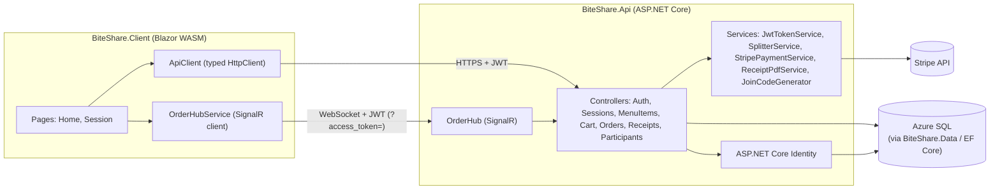

# BiteShare — Architecture

## System overview

## Two token types

BiteShare issues two kinds of JWT from the same signing key, distinguished by a
`token_type` claim:

| Token | Issued by | Used for |
|---|---|---|
| **Identity token** | `/api/auth/register`, `/api/auth/login` | Account-level calls: `POST /api/sessions` (create), `POST /api/sessions/join`, `GET /api/sessions` (my sessions) |
| **Participant token** | `/api/auth/guest-join`, or returned alongside session create/join | Session-scoped calls: cart, menu items, participants, orders, receipts, and the `OrderHub` SignalR connection |

This is what makes the "join without account" guest flow work: a guest never
gets an identity token, only a participant token scoped to the one session
they joined. `[Authorize(Policy = "IdentityOnly")]` / `"ParticipantOnly"` on
each endpoint enforce which one is required.

## Real-time flow (OrderHub)

- One SignalR group per `Session.Id` (`session:{sessionId}`).
- Clients don't need to call `JoinSession` on first connect — `OrderHub.OnConnectedAsync`
  reads the participant token's claims and joins automatically. Clients call it anyway on
  every `Reconnected` event, because SignalR issues a new `ConnectionId` (and therefore
  drops group membership) each time the underlying connection is re-established.
- Controllers push `CartUpdated` and `OrderStatusChanged` events into the group via
  `IHubContext<OrderHub>` after they commit the corresponding DB change — the hub itself
  has no business logic, it's purely a broadcast pipe.

## Cost splitting

`SplitterService` (in `BiteShare.Api/Services`) is the single source of truth for both
split modes:

- **Equal** — grand total divided evenly across everyone with items in the cart.
- **PerItem** — each participant pays their own item subtotal plus a proportional share
  of tax/tip/delivery fee.

Both modes work in integer cents internally and use a deterministic remainder-allocation
rule (largest-remainder method for per-item, round-robin by `ParticipantId` for equal), so
totals always reconcile exactly to the order total — see `tests/BiteShare.Tests/SplitterTests.cs`
for the edge cases this covers.

## Domain model

`Session → Participant → CartItem → Order → Receipt`, with `MenuItem` as the catalog a
session's cart draws from. Full schema lives in `BiteShare.Data/BiteShareDbContext.cs`.
